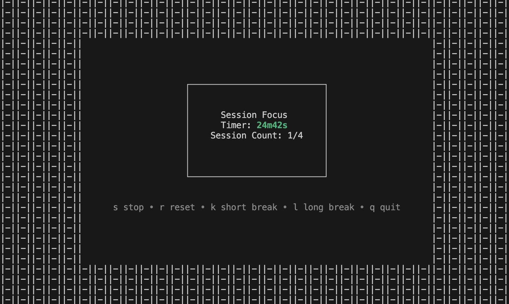

# PomoFocus

A simple TUI Pomodoro timer to help with deep focus. Built primarily for my own use.



## Why?
- The Pomodoro method is a tried and tested method for improving focus.
- This project is a good excuse to use the very aesthetic CharmBracelet Libraries: [bubbletea](https://github.com/charmbracelet/bubbletea) and [lipgoss](https://github.com/charmbracelet/lipgloss).

## Usage

Default behaviour:
- 25 minutes
- 5 minute breaks
- Long breaks every 4th session - ability to trigger long break

Run: 
```bash
task run
go run main.go
```

Run with custom first session (good as just a timer)
```bash
task run -- {{timeout}}
go run main.go {{timeout}}
```

Where `{{timeout}}` is a valid time.Duration string e.g. 10s, 10m, 1h, etc.

